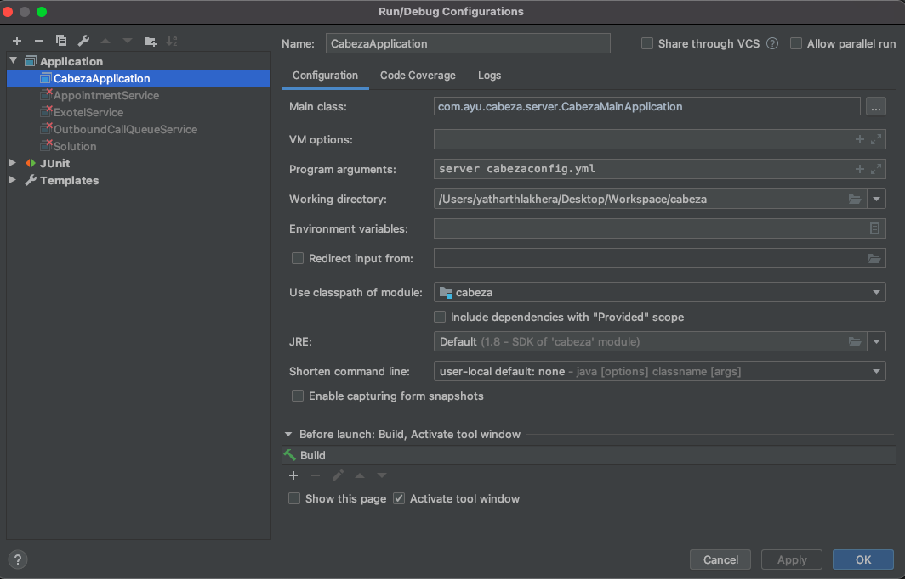
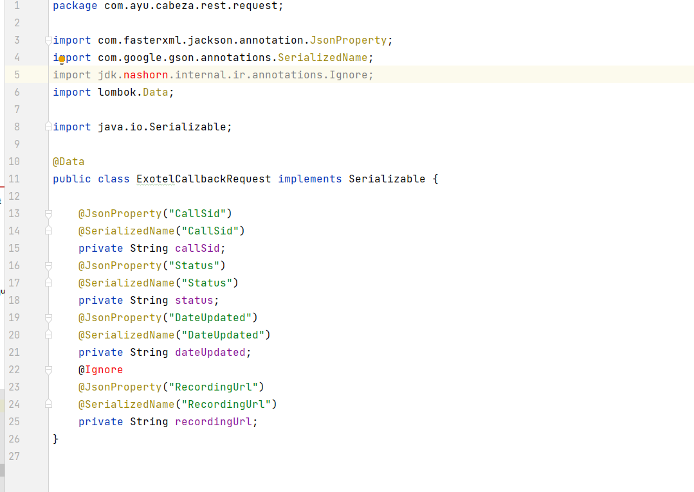
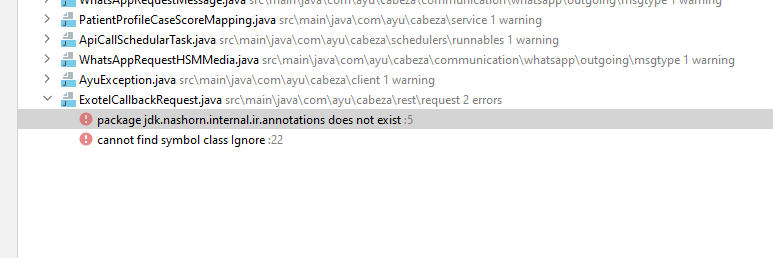

# Cabeza

A brief description of what this project does and who it's for

## Steps to setup the project

1. **Generate SSH keys**

    Mac OS

        https://www.siteground.com/kb/how_to_generate_an_ssh_key_pair_in_mac_os/

    Windows OS

        https://www.howtogeek.com/762863/how-to-generate-ssh-keys-in-windows-10-and-windows-11/

2. **Add SSH keys in GitHub account**

        https://docs.github.com/en/authentication/connecting-to-github-with-ssh/adding-a-new-ssh-key-to-your-github-account

3. **Clone the project**

    *git clone git@github.com:ayu-webmaster/cabeza.git*
    
4. **Project setup**

    Download Java 8
    
        https://www.oracle.com/java/technologies/downloads/#java8-mac

    i.  Import the project as Maven project in IntelliJ

    ii. Configure Java 8 to the project

    iii. Add Lombok plugin to IntelliJ

    iv. Build the project

5. **Configurations**    
    
    i. Add the configuration
    
    
    
    ii.Configure the ip address.

6. **Run app**    

    v. Run CabezaMainApplication main method

    vi. Go to swagger UI

        http://localhost:11901/swagger#/

 ## Trouble Shooting       

If you see JDK issues like below. Download JDK 1.8.0_321 (as mentioned in Step 4 ) and configure it to the project

    
